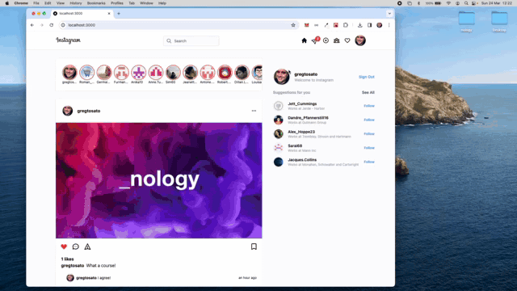

# Instagram Clone

This application mocks the functionality and appearance of the Instagram website. It is fully responsive, working on all media screen sizes. This project is strictly for educational purposes only.

<br />

<div style='text-align: center;'>
  
</div>

<br />
Live deployment: 
<br />
https://leafy-panda-455ef6.netlify.app/

## Requirements / Purpose

This application is built using the following technologies:

-    Next.js
-    Tailwind.css
-    Firestore Database
-    Google Authentication using Next Auth
-    Global State Management using Recoil
-    Faker to retrieve dummy data for usernames and profile avatars
-    Hero Icons to mock appearance of existing site
-    Headless UI to manage modal popup

This project was built to develop a better understanding of integrating Service Provider Authentication (Google) into an application. It uses Next.js to simplify routing and a Firestore database to store user posts. It also uses Firebase Cloud Storage to store images uploaded by users.

## Build Steps

```bash
$ npm install
```

## Running the app

In your root folder, create the following file

-    .env.local

You will need to acquire the following keys and add them to the above file<br/>

GOOGLE_CLIENT_ID={GOOGLE_CLIENT_ID_GOES_HERE}<br/>
To acquire, read the following:<br/>https://developers.google.com/identity/oauth2/web/guides/get-google-api-clientid

GOOGLE_CLIENT_SECRET={GOOGLE_CLIENT_SECRET_GOES_HERE}<br/>
To acquire, read the following:<br/>https://www.atauthentication.com/docs/google

NEXTAUTH_URL={http://localhost:3000 or deployed site}<br/>

NEXTAUTH_SECRET={NEXTAUTH_SECRET_GOES_HERE}<br/>
To acquire, read the following:<br/>https://next-auth.js.org/configuration/options

API_KEY={API_KEY_GOES_HERE}<br/>
To acquire, read the following:<br/>https://firebase.google.com/docs/projects/api-keys

For security reasons, please ensure the .env.local file is added to your .gitignore file.

Once your keys have been added to your project, you can run it.

```bash
# development
$ npm run dev
```

## Design Goals / Functionality

-    To develop an application with similar look and feel of existing site.
-    This is a partial mockup, with only specific functionality added. Once a user is logged in with Google authentication, they can then comment and like posts but typing in the 'Add a comment' field or clicking the heart icon respectively. Users can also upload images and posts by pressing on the plus icon in the header. Users can sign out by clicking on Sign Out, or clicking the avatar image in header.

## Known Issues

-    Search bar and other icons are simply for display purposes only. There is currently no underlying functionality behind these components.

## Future Goals

-    Adding search functionality to thread.

## Roadblocks

-    Integrating NextAuth into development and deployed site. Initial understanding of managing session id was limited, but was later able to resolve after reading through documentation on NextAuth website.
